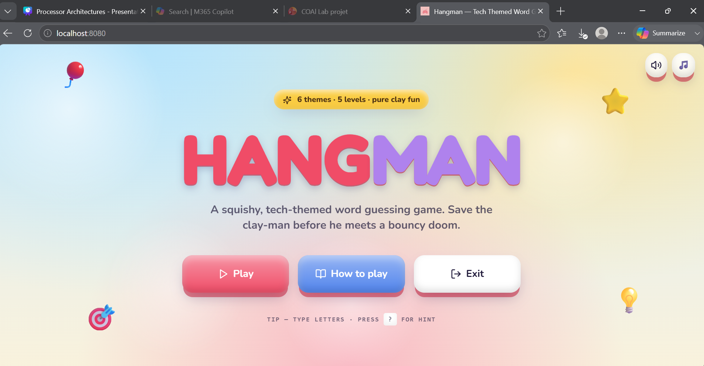
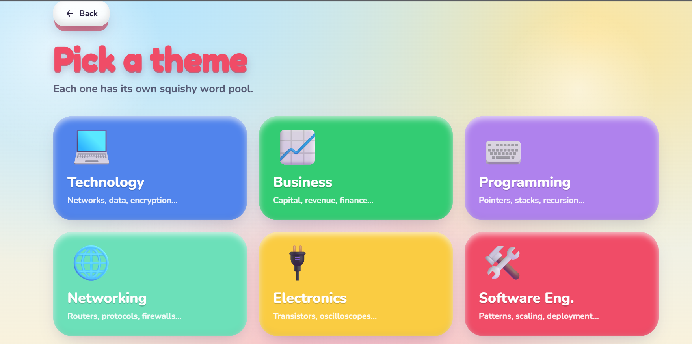
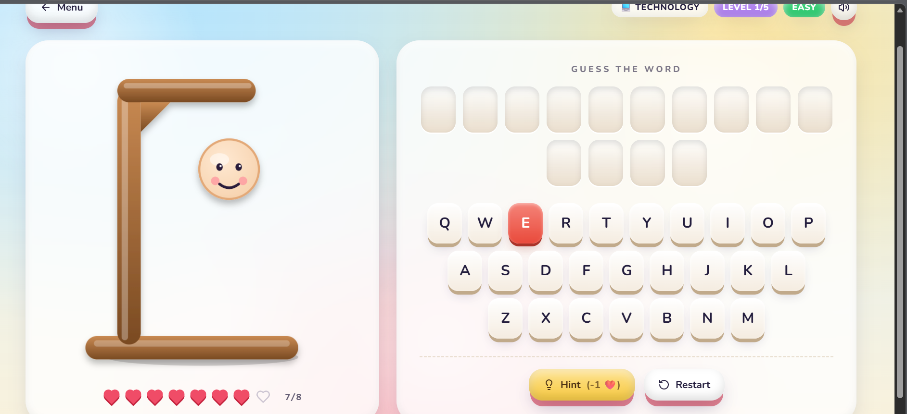
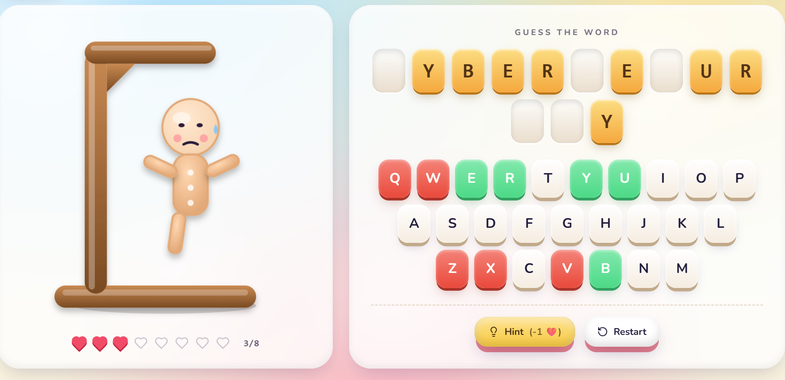
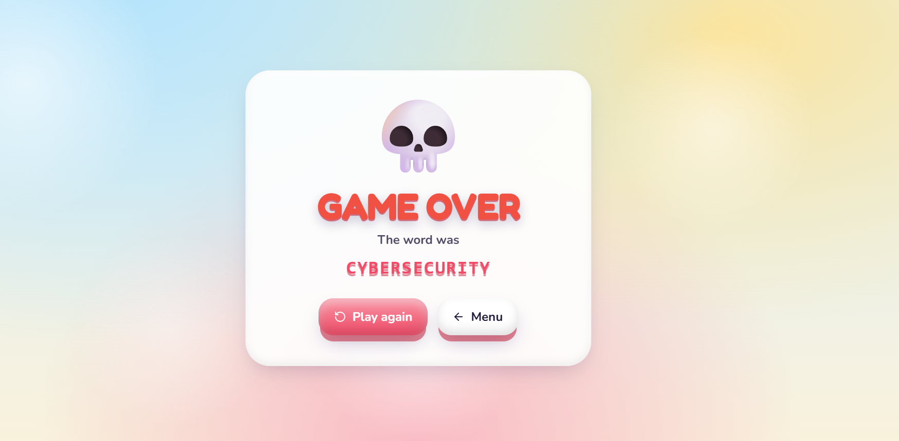

# 🎯 Hangman — x86 Assembly Powered Web Game

> A fully playable browser-based Hangman game where all game logic 
> runs in x86 MASM Assembly language — connected to a React frontend 
> through a C++ bridge and Node.js REST API.

---

# 🏠 Home Page

<p align="center">
  
</p>

---

# 🎨 Theme Selection

<p align="center">
  
</p>

---

# 🎮 Gameplay

<p align="center">
  
</p>

<p align="center">
  
</p>

---

# 💀 Game Over

<p align="center">
  
</p>

---

## 🏗️ Architecture
React Frontend
↓  HTTP
Node.js Express API
↓  execFile()
C++ Bridge (bridge.exe)
↓  linked
x86 MASM Assembly Library (.lib)

Every guess, life deduction, hint, and win/loss check happens 
inside Assembly code running at the lowest level of the stack.

---

## ✨ Features

- 90 words across 6 categories
- 3 difficulty levels (Easy / Medium / Hard)
- Shuffle system — no word repeats until all 15 in a category are used
- Hint system — reveals a letter at the cost of 1 life
- Full win / game over detection
- State persistence across HTTP requests via text files

---

## 🗂️ Word Categories

| # | Category |
|---|---|
| 1 | Business |
| 2 | Technology |
| 3 | Programming |
| 4 | Networking |
| 5 | Electronics |
| 6 | Software Engineering |

---

## 🛠️ Tech Stack

| Layer | Technology |
|---|---|
| Game Logic | x86 MASM Assembly |
| Bridge | C++ (MSVC, cdecl convention) |
| Backend | Node.js + Express |
| Frontend | React |

---

## 🧠 Key Assembly Concepts Used

- Register-based computation (EAX, EBX, ESI, EDI, ECX)
- DWORD pointer tables for word storage
- Linear Congruential Generator for random word selection
- Manual stack frame management (cdecl)
- Bitwise OR for lowercase conversion (`OR bl, 20h`)
- `rep stosb` for buffer initialization
- Conditional jumps for all control flow

---

## 🚀 How to Run

### Prerequisites
- MASM (ml.exe) and lib.exe
- MSVC C++ compiler
- Node.js
- React (npm)

### 1. Compile Assembly Library
```bash
ml /c /coff assembly/hangman_lib.asm
lib /out:bridge/hangman_lib.lib hangman_lib.obj
```

### 2. Compile C++ Bridge
```bash
cl bridge/bridge.cpp bridge/hangman_lib.lib /Fe:bridge/bridge.exe
```

### 3. Run Backend
```bash
cd backend
npm install
node server.js
```

### 4. Run Frontend
```bash
cd frontend
npm install
npm start
```

### 5. Open in Browser
http://localhost:3000

---

## 📁 Project Structure
hangman-x86-fullstack/
├── assembly/          # x86 MASM source — all game logic
├── bridge/            # C++ bridge source
├── hangmanbackend/           # Node.js Express API
├── hangmanfrontend/          # React web interface


---

## 💡 Why This Project

Most Assembly programs written in academic settings are standalone 
console apps dependent on teaching libraries. This project removes 
those limitations entirely — the Assembly code has no external 
dependencies, follows standard cdecl calling conventions, and 
functions as a portable library driving a real web application.

---

